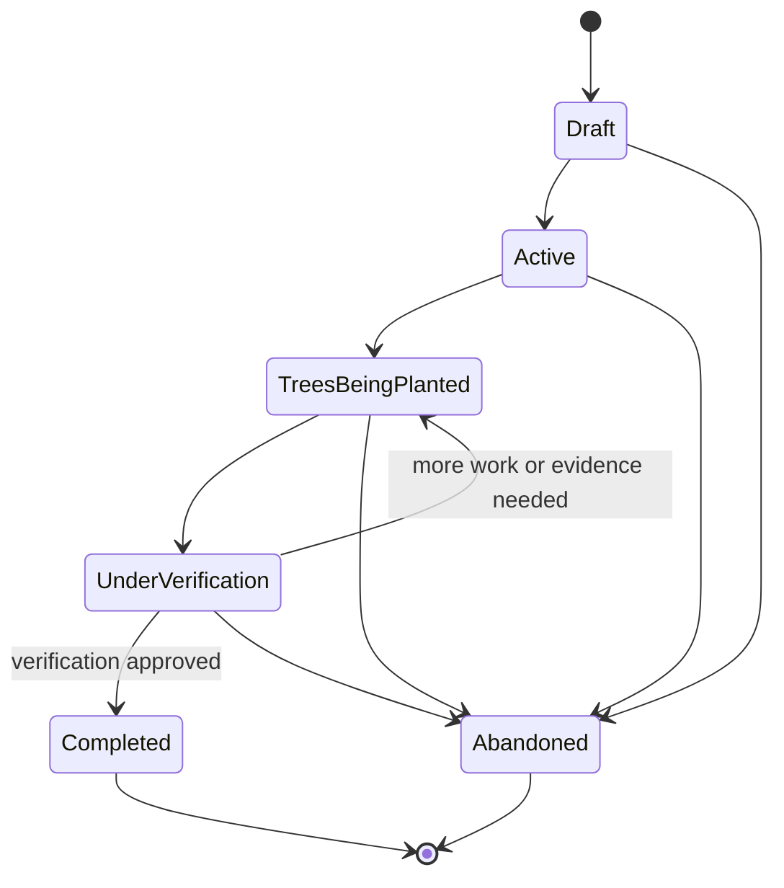

# Campaign lifecycle states

This page documents the six valid states in the campaign's product lifecycle. A campaign is in exactly one of these states at a time.

> **Scope:** These are the campaign lifecycle states used to describe a tree-planting campaign. The on-chain funding contract has its own operational statuses (for example, `Successful`, `Failed`, and `Claimed`) for escrow, refunds, and payouts; those contract statuses are documented in the [campaign guide](campaign-guide.md).

## States

| State | Meaning | Typical entry point |
|---|---|---|
| `Draft` | The campaign is being prepared. Its details can be completed before it is made available to supporters. | Campaign creation |
| `Active` | The campaign is live and accepting support. | The creator launches a prepared draft. |
| `TreesBeingPlanted` | Funding has concluded and the planting work is underway. | The campaign proceeds from its active fundraising phase. |
| `UnderVerification` | Planting has been reported and evidence is being reviewed to confirm the claimed work. | Planting work is submitted for review. |
| `Completed` | Verification has passed and the campaign lifecycle is successfully finished. | Verification approves the planting evidence. |
| `Abandoned` | The campaign has been stopped without successful completion. This is a terminal state. | The campaign is stopped before completion. |

## Valid transitions

The normal path is `Draft` → `Active` → `TreesBeingPlanted` → `UnderVerification` → `Completed`. A campaign may be moved to `Abandoned` before it reaches a terminal state. If verification finds that more planting work or evidence is needed, the campaign returns to `TreesBeingPlanted` before it is submitted for verification again.

| Current state | Allowed next state(s) |
|---|---|
| `Draft` | `Active`, `Abandoned` |
| `Active` | `TreesBeingPlanted`, `Abandoned` |
| `TreesBeingPlanted` | `UnderVerification`, `Abandoned` |
| `UnderVerification` | `TreesBeingPlanted`, `Completed`, `Abandoned` |
| `Completed` | None — terminal |
| `Abandoned` | None — terminal |

`Completed` and `Abandoned` cannot transition back into an in-progress state. The review outcome determines whether a campaign under verification completes or returns to planting work.
